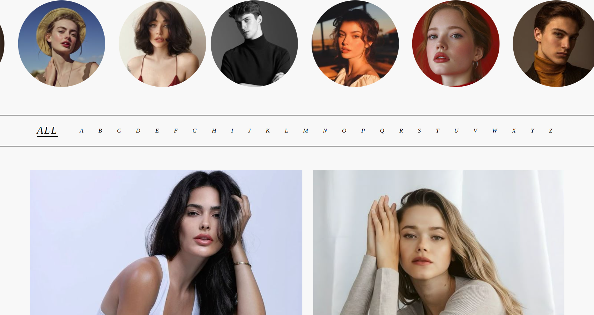

# ✨ Premier - Fashion Portfolio

> A sleek and modern fashion portfolio showcasing creative designs and style aesthetics through clean HTML & CSS

  

## 🎯 Overview

This fashion portfolio presents a curated collection of designs, style inspirations, and creative work in the fashion industry. Built with pure HTML and CSS, it emphasizes visual storytelling and aesthetic appeal to showcase fashion pieces and design concepts.

## ✨ Features

- **Visual-First Design** - Image-heavy layout perfect for showcasing fashion photography
- **Clean Typography** - Carefully selected fonts that complement the fashion aesthetic
- **Smooth Animations** - CSS transitions and hover effects for enhanced user experience
- **Gallery Layouts** - Multiple grid systems to display different types of fashion content
- **Custom Styling** - Hand-crafted CSS without relying on frameworks

## 🖥️ Tech Stack

- **HTML5** - Semantic markup for better structure and accessibility
- **CSS3** - Advanced styling with Flexbox/Grid, animations, and custom properties
- **Pure CSS** - No frameworks or libraries for complete creative control

## 📱 Responsive Design Note

Currently optimized for desktop viewing with basic mobile adaptations. The portfolio delivers the best experience on larger screens where fashion imagery can be fully appreciated. Mobile responsiveness improvements are planned for future updates.

## 🎨 Design Philosophy

This portfolio embraces **minimalism meets boldness** - letting the fashion pieces speak for themselves while providing a sophisticated backdrop that enhances rather than competes with the content. Every design decision prioritizes the visual impact of the fashion work.

## 🔮 Future Enhancements

- [ ] **Enhanced Mobile Experience** - Improved responsive design for all devices
- [ ] **Performance Optimization** - Image compression and lazy loading
- [ ] **Interactive Elements** - More engaging hover states and micro-interactions
- [ ] **Accessibility Improvements** - Better screen reader support and keyboard navigation
- [ ] **Content Management** - Easy way to update portfolio pieces

## 🌟 Highlights

**What makes this portfolio special:**
- Authentic fashion industry aesthetic
- Fast loading with pure CSS
- Customizable and easily maintainable
- Focus on visual storytelling
- Professional presentation suitable for client showcases

## 📞 Connect

Feel free to reach out for collaborations, feedback, or just to chat about fashion and design!

---

*Built with passion for fashion and attention to detail* 💫